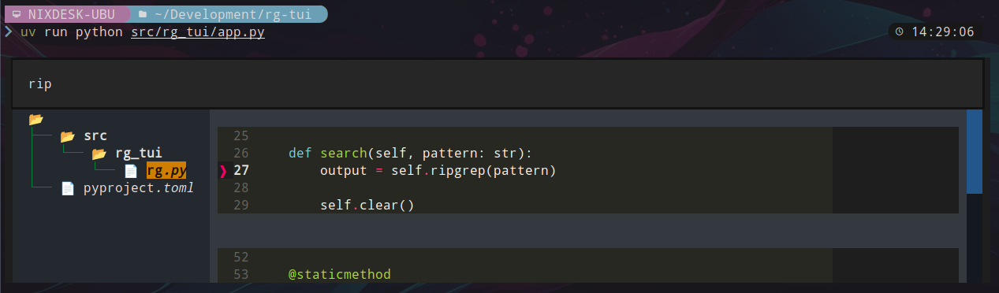
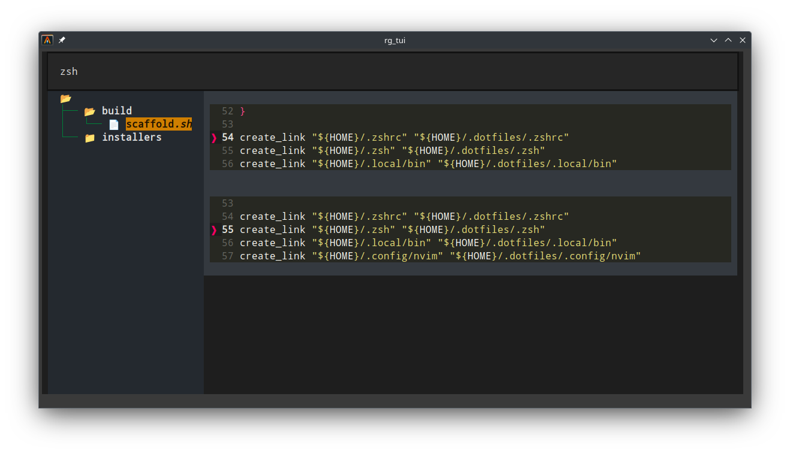

# rg-tui
**rg-tui** is a terminal interface for `ripgrep`.



## Installation

- Download a released `.whl` from [releases](https://github.com/NixonInnes/rg-tui/releases)  
- Install with `pipx`  
```bash
pipx path/to/rg_tui-<version>-py3-none-any.whl
```
> See [pipx](https://github.com/pypa/pipx)

## Usage
**rg-tui** consists of 3 panes.
 - Input
 - Directory tree
 - Results list

  

Pressing `Tab` will cycle through the panes.  

When you enter a search pattern in the Input pane, Ripgrep will be used to search the current directory for the entered pattern.  

Files containing the matching pattern will be populated into the directory tree.  
You can navigate the Directory tree using the directional keys. Pressing `Return` on an item in the tree will either expand/collapse the folder, or open the file search results in the Results list.  

If a file has been selected (from the Directory tree), the matches will be added to the Results list.  
You can navigate through the Results list using the directional keys. Pressing `Return` on a result item will open your defined editor at the match location.  

> Note: Your editor must be set in your environment (`$EDITOR`)

**rg-tui** specifies two entry points:
 - `rg_tui` - fullscreen mode  
 - `rg_tui_inline` - inline mode

**inline mode:**  

